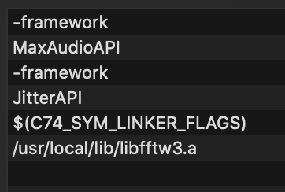
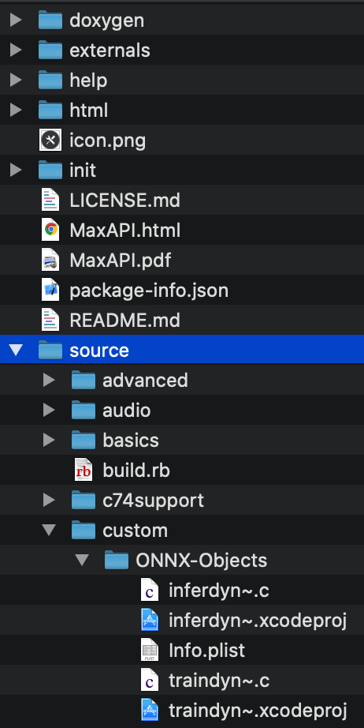

# Real-Time detection of piano using Neural Networks

## Summary
Real-time Piano Detection - a paradigm for working with Pytorch->ONNX->Max/MSP.

As an example we show the ability to develop a low-latency detection algorithm for acoustic piano.
This paradigm is an open source and can be easily used by artists and researchers to combine NN models
in music and art applications.

## Method

The example provides interface to Max/MSP by using two external objects. The workflow is as follow:

1. Generate a training set by using the external object traindyn~.mxo. This will create the dataset and label files.
2. Train a model using Pytorch.
3. Use the trained model with the external inferdyn~.mxo for inference. This is done by interfacing to ONNX-realtime c++ library.


## Instructions

### PreRequisits for recompiling the objects (MACOS)

#### Install `fftw-3` :
0.1 Download [fftw-3](http://www.fftw.org/install/mac.html), then compile and install it (as stated in the in the install section):
```bash
cd fft-3.3.8
./configure && make
sudo make install
```
This will create a static - `.a` - file in `/usr/local/lib`: `libfftw3.a` .<br>
This needs to replace the .dylib file in the Linker Flag entry of the `Build Settings`:
In the field ` Other Linker Flags` change it to this :


#### MAX SDK :
0.2 Install the maxSDK to your computer from [here](https://cycling74.com/downloads/sdk/). <br>
Bring the folder `source` 2 folder down from the root of the maxSDK folder, as stated [here](https://cycling74.com/sdk/max-sdk-7.3.3/html/chapter_platform.html). <br>
For example - renaming it ONNX-Objects -, and encapsulating it in customs :



### Setting up the ONNX:
1. First download the realtime dynamic libraries from onnx-realtime microsoft:     https://github.com/microsoft/onnxruntime/releases/tag/v1.1.0

2. Now you need to create the dynamic lib which will be used within max object, this is done by compiling the connx/main.cpp file.
- There is one precompiled lib that can be used, called mainlib.so.
- but if you want to compile from source or you use other version than onnxruntime v1.1.0.
    For example, in terminal go to the path connx/main.cpp  (ensure the correct path to ONNX, and the correct   
    version):

    g++ -shared -o libmain.so main.cpp -IPATH/TO/ONNX/onnxruntime-osx-x64-1.1.0/include/ -L"PATH/TO/ONNX/onnxruntime-osx-x64-     1.1.0/lib" -lonnxruntime.1.1.0 -lonnxruntime -std=c++14 -Wl,-rpath,"@executable_path/PATH/TO/ONNX/onnxruntime-osx-x64-    
    1.1.0/lib"


### Setting up in max:


3. Open the maxsource/training_set.maxhelp in max and add the external object path. Follow the instructions in the patch.
(OSX, but source code avialable to build in windows)
4. Load piano vst or input piano and use inference with exsited ONNX model (see /model_pytorch/trainedmodels), or create a new training set.

### Train a new model in PyTorch to Max:
5. Follow the python notebook to train and export a new ONNX model then load it in inferdyn~ object in max.
